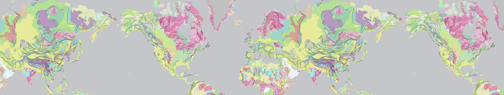
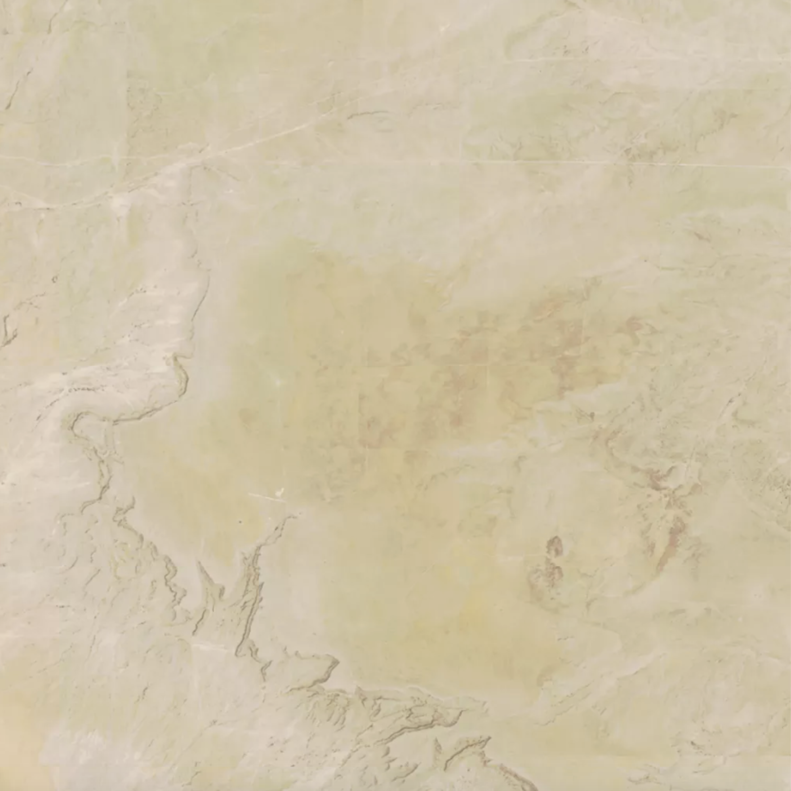
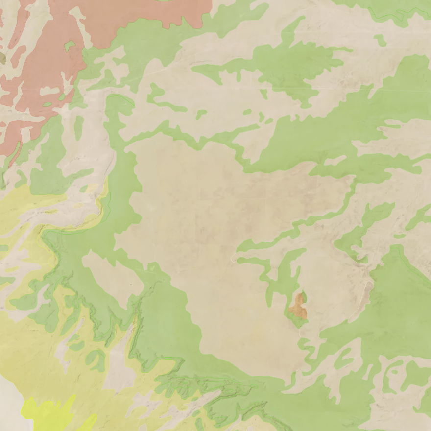
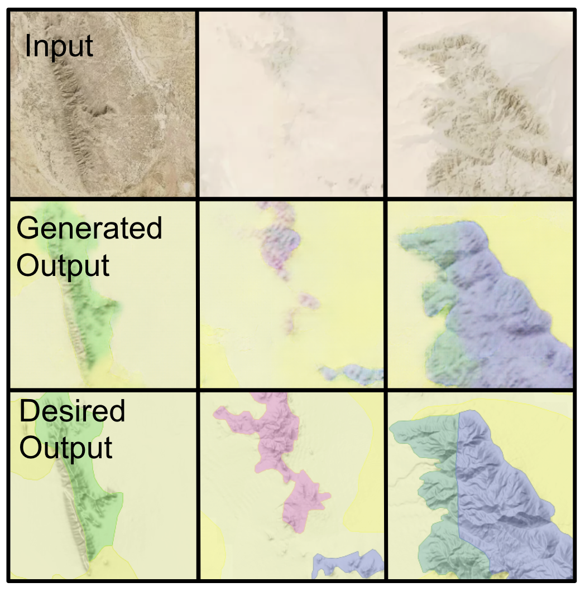
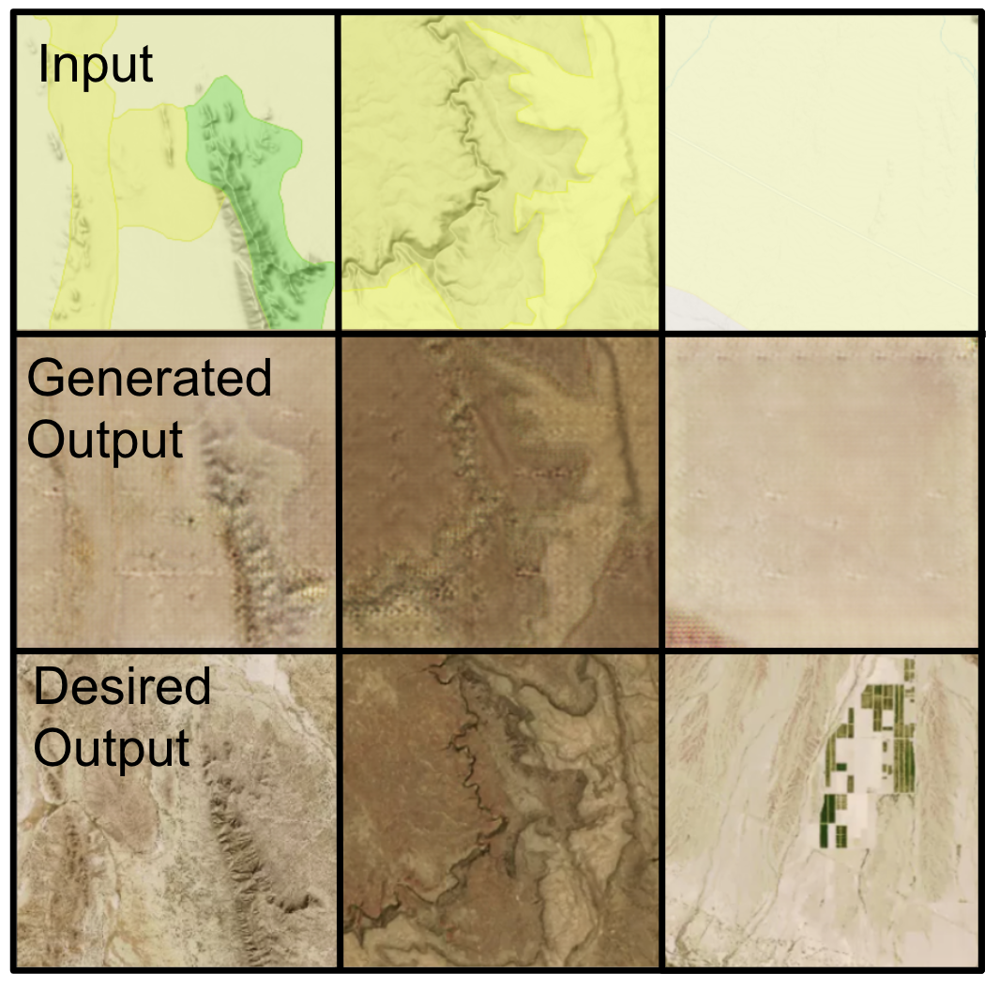
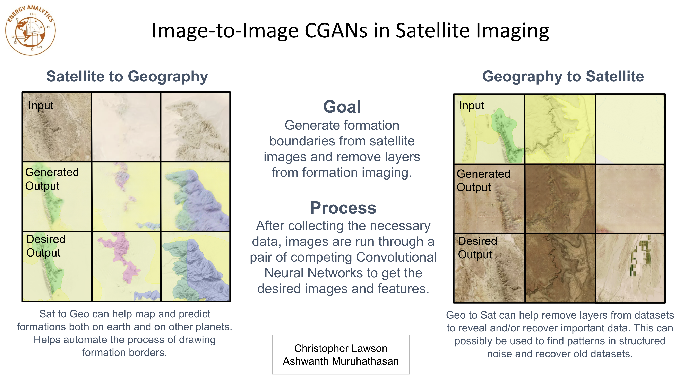

<p align="center"></p>

# Sat to Geo Sprint 1

## Resources
  * [Pytorch-GAN](https://github.com/eriklindernoren/PyTorch-GAN): Trained data on the pix2pix implementation
  * [Macrostrat](https://macrostrat.org/map/#/z=1.5/x=16/y=23/bedrock/lines/) and [Mapbox](https://www.mapbox.com/): Pull formation and satellite data
  
### Satellite imaging
<p align="left"></p>

### Formation imaging
<p align="left"></p>

## pix2pix GAN Training Instructions

### Notes
  * CUDA support optional (requires Nvidia GPU)

### Run GAN
```
git clone https://github.com/eriklindernoren/PyTorch-GAN
cd Pytorch-GAN/
sudo pip3 install -r requirements

# move <Dataset>/ into data/

cd implementations/pix2pix
python3 pix2pix.py —dataset_name <Dataset>

# images/ saves testing output
# saved_models/ saves generator and discriminator
```

### Datasets used
  * Collected_Images/Split_Images

## Sprint 1 Results

### Satellite to Geology
Trained a pix2pix GAN on predicting formation shapes on basic satellite image data.

#### Results
<p align="left"></p>

#### Analysis
There are varied results when viewing these output images. At first glance, it seems to be performing semi-accurately, but it fails to detect a larger pattern. This may mean that there lacks a subpattern in the satellite data that allows for prediction of formations. However, there are paths that need to be exhausted before we make this assumption. The randomness of the coloring scheme may be affecting the GANs ability to estimate where these formations start and end. 

#### Next Steps
Some next steps for this include finding better input and output data that may share more of a correlation, including grayscaling formation output images or adding more emphasized edges through Python CV edge detection. 

### Geology to Satellite
Trained a pix2pix GAN on removing formation layers from geology data in Macrostrat to reveal the true coloring of satellite images. 

#### Results
<p align="left"></p>

#### Analysis
The GAN seemed to be relatively successful when peeling back layers of formation data to reveal the satellite imaging underneath. An interesting result here is the removal of specific physical traits of the image, such as farms being removed from generated output image. 

After further analysis, it has become apparent that the function of this GAN is not being completely utilized as there is no general recognition of subpatterns in this data to determine the pizxel coloring, and the GAN is instead memorizing the opacity and color of the formation layer to predict the RGB differences. This gives the GAN an easy job and requires little training time to achieve a desirable result.

#### Next Steps
There are other applications for layer removal using GANs, including detecting structured noise and recovering corrupted and layered datasets. The next step for this aspect of the project is to introduce different levels of structured noise train the GAN on these altered images. 

## Dr. Pyrcz Presentation Slide
<p align="left"></p>
