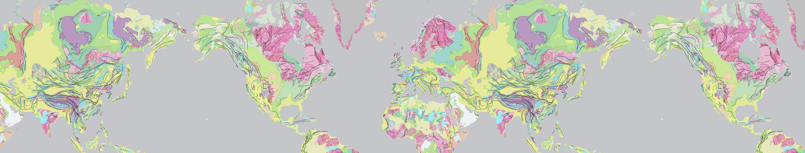
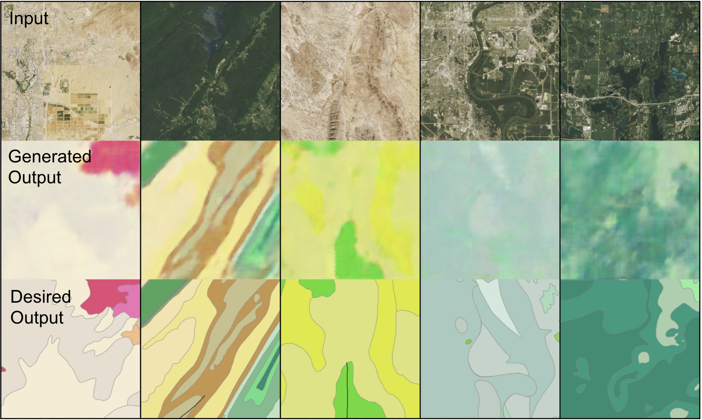
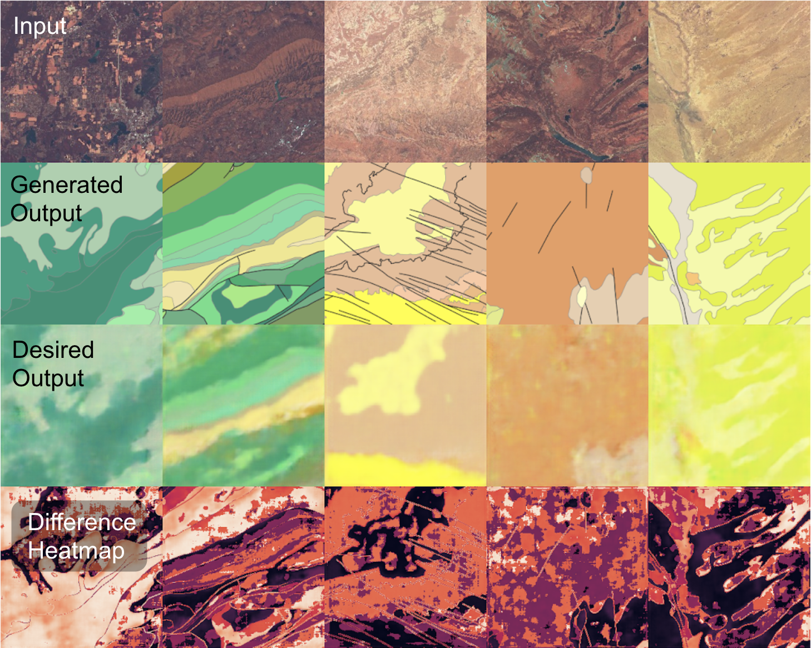
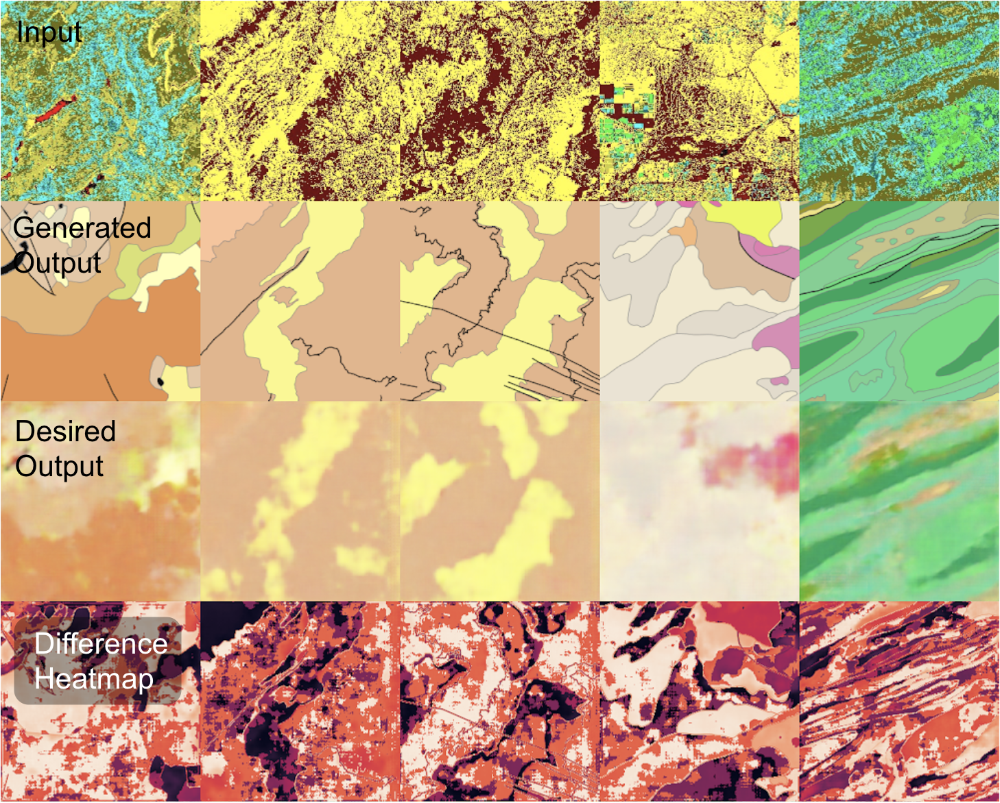
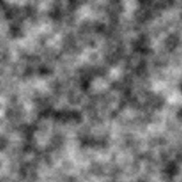
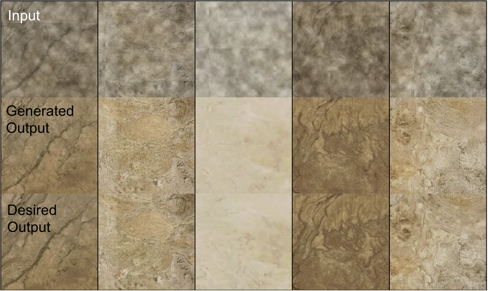

<p align="center"></p>

# Sat to Geo Sprint 2

## Resources
  * [Pytorch-GAN](https://github.com/eriklindernoren/PyTorch-GAN): Trained data on the pix2pix implementation
  * [Macrostrat](https://macrostrat.org/map/#/z=1.5/x=16/y=23/bedrock/lines/), [Mapbox](https://www.mapbox.com/), and [SentinelHub](https://apps.sentinel-hub.com/sentinel-playground/): Pull formation and satellite data
  * [p5.js](https://p5js.org/): Generate 2D Perlin Noise

## pix2pix GAN Training Instructions

### Notes
  * CUDA support optional (requires Nvidia GPU)

### Run GAN
```
git clone https://github.com/eriklindernoren/PyTorch-GAN
cd Pytorch-GAN/
sudo pip3 install -r requirements

# move <Dataset>/ into data/

cd implementations/pix2pix
python3 pix2pix.py —dataset_name <Dataset>

# images/ saves testing output
# saved_models/ saves generator and discriminator
```

### Datasets used
  * ImageRefining/Collected_Images/DMU_Dataset/
  * ImageRefining/Collected_Images/D_Dataset/
  * NoiseDetection/NoiseImages/perlin/

## Sprint 2 Results

### Satellite to Geology
Trained a pix2pix GAN on deserts, mountains, and urban areas in order to accurately draw formation borders for those areas.

#### Approach
First, we needed to expand our dataset to include mountains and urban areas. After that, we tried to train a model on those images without any kind of alteration and found out that, for deserts and mountains, the model was fairly accurate when it came to drawing the borders. With urban areas on the other hand, it was really bad.

To combat this, we decided to change the color bounds when looking at urban areas. Instead of only looking at the traditional red, blue, and green color bands, we chose several of the pre-established bands on a website called Sentinel EO, Playground. We then trained a model on the urban data given each one of the different bands and compared the results. We found out that it looked like 4 bands were able to most accurately draw the borders but we have yet to conclude on any of the bands.

#### Results

##### Desert/Mountain/Urban Unaltered
<p align="left"></p>

##### Desert/Mountain/Urban Geology Band
<p align="left"></p>

##### Desert/Mountain/Urban Vegetation Index
<p align="left"></p>

#### Analysis
It looks like our model works very well for drawing border lines for desert and in mountain areas but still needs work to predict urban areas as there are no noticeable features that indicate where a border should go. 

#### Next Steps
We want to change our code to make sure that the training/testing data is completely different from the validation data as it looks like the images might be over fit to images within the data. Next we want to further automate our data collection code as it would make it easier to incorporate more images. Lastly, we want to continue looking into the different bands to see which bands increase our prediction score.

### Satellite Imaging Structured Noise Removal
Trained a pix2pix GAN on removing 2-dimensional Perlin Noise from satellite Imaging.

#### Approach
A program first generated an image of a grayscale 2D Perlin Noise, then overlayed that image on top of a satellite image with a random shift in both the x and y direction with overlap for each image. This removed the ability for the GAN to simply memorize the pixel opacity and colors of the  attern and instead forced the GAN to utilize it's ability to recognize multi-pixel subpatterns in the data when determining image recreation. 

#### Results

##### Perlin Image Generation
<p align="left"></p>

##### Perlin Shift Overlay Removal
<p align="left"></p>

#### Analysis
The GAN was very successful in recognizing these sorts of subpatterns, and had a G-loss of under .05 by the 25th epoch. 

However, it's important to recognize some of it's failures, which include it's lack of accuracy when processing images with a lack of RGB diversity. Here it tends to produce a very monotone image with too little variation in coloring. 

Unlike the result from the last Geology to Satellite experiment, it is clear here that the GAN is recognizing mutli-pixel patterns in the data rather than memorizing specific RGBs and opacities of formation shadings. 

#### Next Steps
After a note from mentors, I will be exploring 2D Perlin's similarity to Sequential Gaussian Simulation for terrain generation. I will also be exploring the ability for NN CGANs to detect structured noise produced by measuring tools, perhaps producing a clean datasets with disregard to the flaws of the measuring instrument. 
