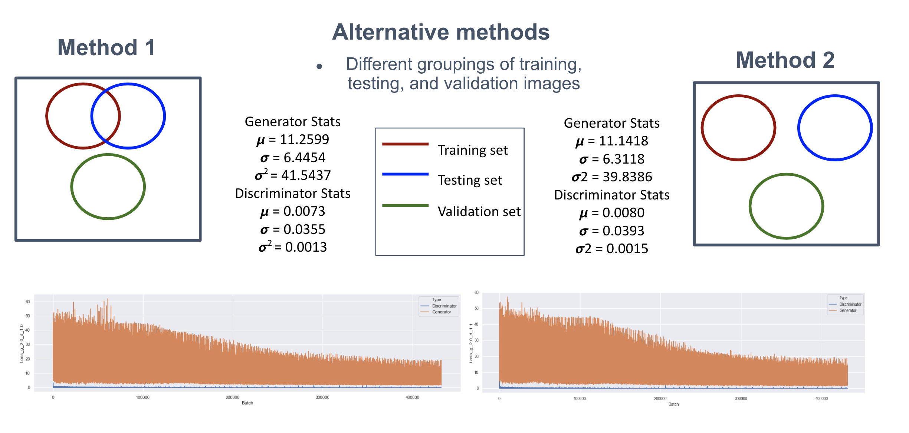
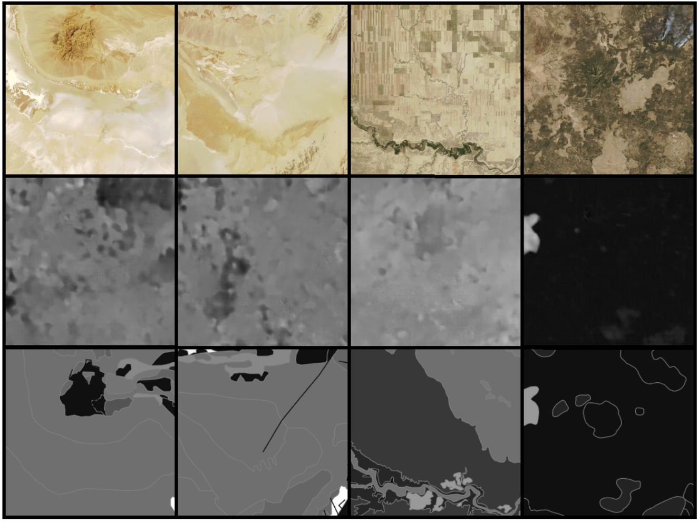
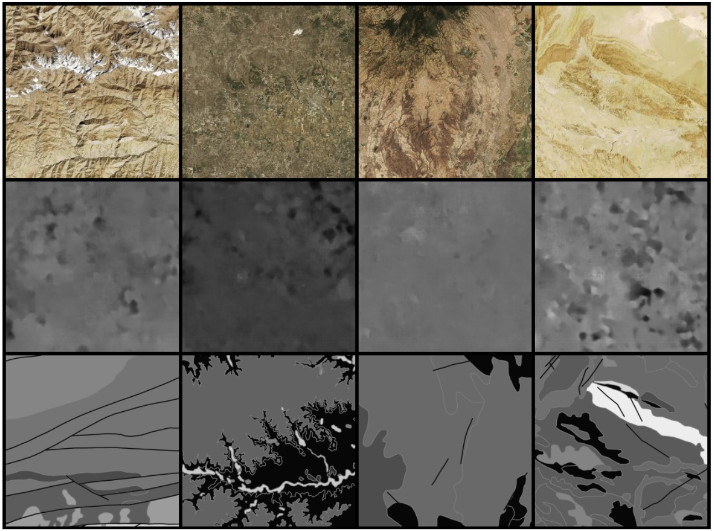
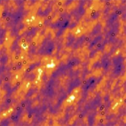
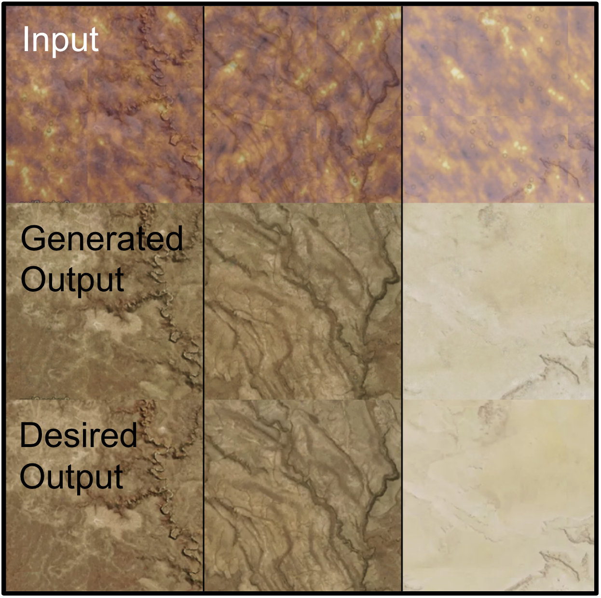
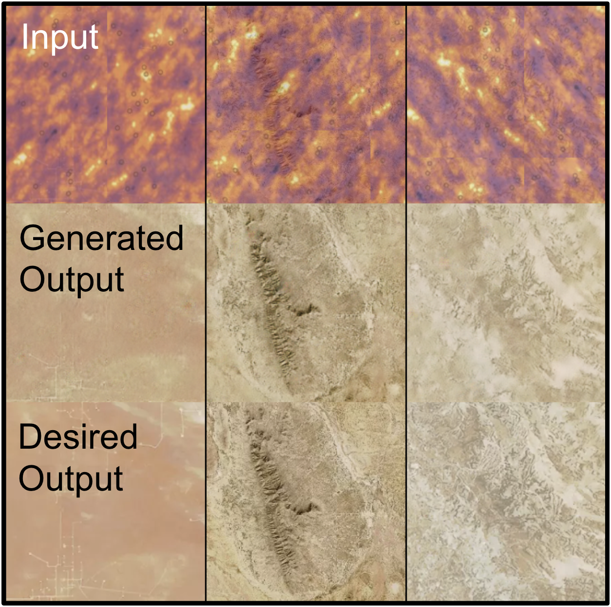
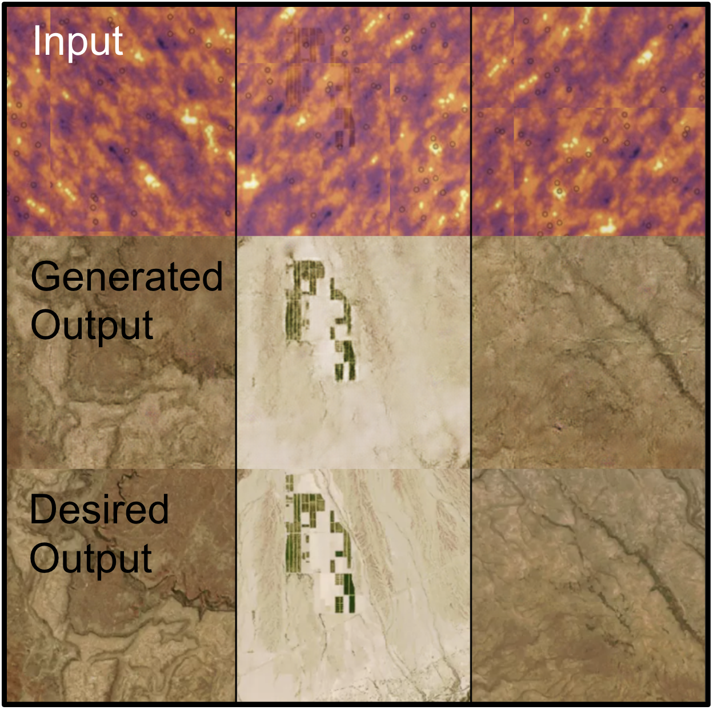

<p align="center"></p>

# Sat to Geo Sprint 3

## Resources
  * [Pytorch-GAN](https://github.com/eriklindernoren/PyTorch-GAN): Trained data on the pix2pix implementation
    * [Pix2pix GAN Paper](https://phillipi.github.io/pix2pix/)
  * [Macrostrat](https://macrostrat.org/map/#/z=1.5/x=16/y=23/bedrock/lines/), [Mapbox](https://www.mapbox.com/), and [SentinelHub](https://apps.sentinel-hub.com/sentinel-playground/): Pull formation and satellite data
  * [p5.js](https://p5js.org/): Generate 2D Perlin Noise
  * [GeostatsPy](https://github.com/GeostatsGuy/GeostatsPy): Generate Sequantial Gaussian Simulation

## pix2pix GAN Training Instructions

### Notes
  * CUDA support optional (requires Nvidia GPU)

### Run GAN
```
git clone https://github.com/eriklindernoren/PyTorch-GAN
cd Pytorch-GAN/
sudo pip3 install -r requirements

# move <Dataset>/ into data/

cd implementations/pix2pix
python3 pix2pix.py —dataset_name <Dataset>

# images/ saves testing output
# saved_models/ saves generator and discriminator
```

### Datasets used
  * NoiseDetection/Datasets/sgs_0.4/
  * NoiseDetection/Datasets/sgs_0.6/
  * NoiseDetection/Datasets/sgs_0.8/

## Sprint 3 Results

### Satellite to Geology

#### Approach
Winding our dataset from sprint 2 to only include desert and mountain images as we were having too many difficulties with trying to find a reliable way to be able to draw formation borders on urban areas.

As such we did our best to optimize the GAN for these two subsets to try to get the best performance out of them.

The different methods that we took to try to optimize the GAN is by adding different numbers of dropout layers, each with different percentages to drop out for both the generator and the discriminator.

We also did more work to try to get image collection and image splitting to be as clean as possible. This involved making sure that the three different sets used to train the model (testing, training, and validation) were connected to each other in different ways. For example, one model, the testing and training sets were pulling subimages from the same source of images while the validation set was pulling subimages from a completely different set of images.

The metrics that we were using to make sure that the model was doing well was by looking at individual generator and discriminator losses along with looking at a rolling average for those two metrics to see how the model did overtime.

#### Results

##### Statistics
<p align="left"></p>

##### Complete Data Split
<p align="left"></p>

##### Test/Train Data Split
<p align="left"></p>

#### Analysis
The results looked like regardless of the percentages of drop out layers for the generator or the discriminator, the running average for the generator loss and the discriminator loss stayed relatively the same. The biggest impact we saw was by making sure that the images used in each of the three sets were completely disjoint from one another.

It seems like the GAN was able to reliably draw formation borders around the desert and mountain images.

#### Next Steps
Next would be to try to include urban areas and find a way to distinguish different formations within them through something other than it’s satellite image. This is because most urban areas are either too densely populated to even see the earth it was built on or they have gone to great efforts to pave the ground to not show anything.

### Satellite Imaging Structured Noise Removal
Trained a pix2pix GAN on removing Sequential Gaussian Simulation (SGS) imaging at different opacities.

#### Approach
A program first generated Sequential Gaussian Simulat imaging, then overlayed that image on top of a satellite image with a random shift in both the x and y direction with overlap for each image. This removed the ability for the GAN to simply memorize the pixel opacity and colors of the pattern and instead forced the GAN to utilize it's ability to recognize multi-pixel subpatterns in the data when determining image recreation. 

I also varied opacity to increased the intensity of the training, using datasets with 40%, 60% and 80% opacity of noise. 

#### Results

##### SGS Image Generation
<p align="left"></p>

##### SGS Shift Overlay Removal (40% opacity)
<p align="left"></p>

##### SGS Shift Overlay Removal (60% opacity)
<p align="left"></p>

##### SGS Shift Overlay Removal (80% opacity)
<p align="left"></p>

#### Analysis

Overall, this was gaain a successful round of training, with the results from the GAN being close to identical when compared to the expected output. 

#### Next Steps
Another way to properly utilize the GAN's capabilities is to add multiple patterns within the images, specifically wariping, to better model structered noise in field measuring tools. 
